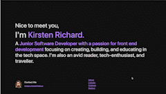

# Kirsten's Portfolio Website

This project was bootstrapped with [Create React App](https://github.com/facebook/create-react-app). This site holds some of my most recent work experiences and projects. Also can be found at [this Netlify link](https://kirstenr.netlify.app/). 

Built with React, JS, HTML, and CSS. 
Deployed with Heroku.

## Available Scripts

In the project directory, you can run:

### `npm start`

Runs the app in the development mode.\
Open [http://localhost:3000](http://localhost:3000) to view it in the browser.

The page will reload if you make edits.\
You will also see any lint errors in the console.

